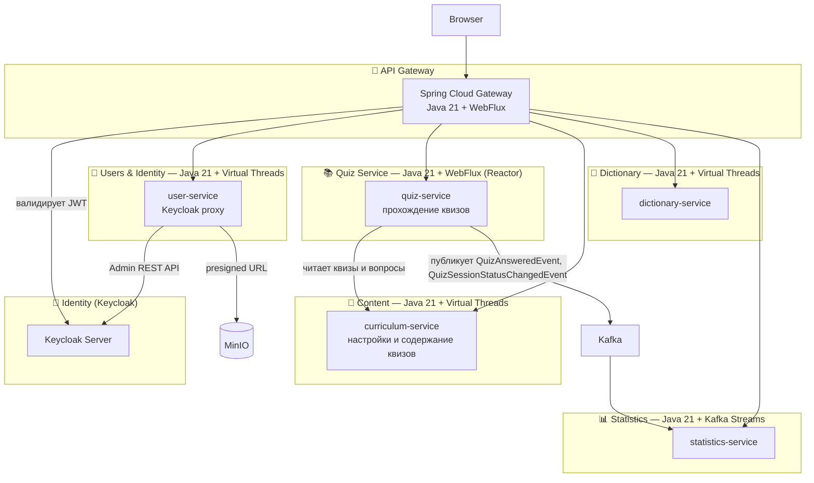

# SamskrtamApp — Project Specification

> Specification-Driven Development · Microservices · Monorepo
> Stack: Java 21 + Virtual Threads · WebFlux (gateway, quiz-service) · React/TypeScript · PostgreSQL · Keycloak · Kafka · MinIO · Grafana Stack (Tempo · Loki · Prometheus)

---

## 1. Обзор проекта

**Название:** SamskrtamApp
**Назначение:** Платформа для изучения санскрита через квизы, поиск по словарю и отслеживание прогресса.
**Архитектура:** Микросервисы (монорепо), Contract-First SDD
**Язык интерфейса:** Русский + English (i18n с первого дня)

SamskrtamApp построен как референсная реализация современной Java-микросервисной системы — но не в силу необходимости, а как учебный полигон для практического знакомства с технологиями. Архитектура намеренно избыточна для реальных задач проекта и охватывает паттерны, актуальные при высокой нагрузке: событийную асинхронность через Kafka, stateless-сервисы, централизованную аутентификацию через Gateway, Specification-Driven Development.

---

## 2. Goals & Non-Goals

### Goals (v1.0)
- Квизы по грамматике санскрита (склонения, спряжения) и лексике
- Словарь с fallback на внешнее API
- Статистика через очередь событий
- Групповой лидерборд
- Аутентификация: Keycloak (собственный аккаунт + Google + Mail.ru)
- Горизонтальное масштабирование: stateless-сервисы, Kafka для async
- Bilingual UI (ru / en)
- [Упражнения по сандхи (Eamenau)](./services/curriculum-service/eamenau.md) — разбор правил сандхи на материале учебника Eméneau

### Non-Goals (v1.0)
- Mobile native app
- Аудио произношения

---

## 3. Язык и стек по сервисам

| Сервис | Язык | Async-модель | Причина |
|---|---|---|---|
| api-gateway | Java 21 | WebFlux (Reactor) | Gateway требует реактивный стек |
| feature-flag-service | Java 21 | Virtual Threads | Простой CRUD + Redis, реактивность избыточна |
| user-service | Java 21 | Virtual Threads | Профили, регистрация, аватарки, блокировка |
| curriculum-service | Java 21 | Virtual Threads | CRUD настроек квизов и вопросов, иерархические категории для VOCABULARY-квизов, домен Eamenau (упражнения по сандхи) |
| quiz-service | Java 21 | WebFlux (Reactor) + R2DBC | Единый сервис прохождения всех квизов, публикация событий в Kafka через Outbox Pattern |
| dictionary-service | Java 21 | Virtual Threads | Поиск по словарю, fallback на внешнее API |
| statistics-service | Java 21 | Kafka Streams | Расчёт статистики и лидерборда |
| sangraha-service | Java 21 | Virtual Threads | Санскритские произведения, LLM-анализ стихов |
| curriculum-service | Java 21 | Virtual Threads | Учебный план: темы (Topic) и мягкие prerequisite-связи + модуль lexicon (учебная лексика, таксономии, batch-импорт из sangraha-service, см. `services/curriculum-service.md` §9), независимая схема БД, без наполнения квизов-заданий |
| shared/samskrtam-dtos | Java 21 | — | Общий модуль DTO и событий для квизов, контента и статистики |
| shared/common-dto | Java 21 | — | Общие DTO для всех сервисов |

---

## 4. Bounded Contexts

---

## 5. Specification Files

### Architecture

| Файл | Содержание |
|---|---|
| [README.md](./README.md) | Этот файл — обзор проекта |
| [architecture.md](./architecture.md) | Топология, технологии, монорепо, ключевые архитектурные решения |
| [conventions.md](./conventions.md) | Соглашения: конфигурация, логирование, трассировка, тесты, git |
| [infra/keycloak.md](./infra/keycloak.md) | Аутентификация, identity providers, JWT claims |
| [services/api-gateway.md](./services/api-gateway.md) | Маршруты, фильтры, rate limiting, OAuth2 flow |
| [services/feature-flag-service.md](./services/feature-flag-service.md) | Feature flags — управление поведением без деплоя |

### Per-Service Specifications

| Файл | Стек | Содержание |
|---|---|---|
| [services/api-gateway.md](./services/api-gateway.md) | Java 21 + WebFlux | Spring Cloud Gateway |
| [services/feature-flag-service.md](./services/feature-flag-service.md) | Java 21 + VT | Feature Flag Service |
| [services/user-service.md](./services/user-service.md) | Java 21 + VT | Логин, регистрация, OAuth, управление паролем |
| [services/curriculum-service.md](services/curriculum-service.md) | Java 21 + VT | Настройки и содержание всех квизов |
| [services/curriculum-service/eamenau.md](./services/curriculum-service/eamenau.md) | домен curriculum-service | Упражнения по сандхи, фонемная система |
| [services/quest-engine.md](./services/quest-engine.md) | Java 21 | quiz-service — прохождение квизов, прогресс, spaced repetition |
| [services/quest-catalog.md](services/curriculum-service/quest-catalog.md) | — | Каталог типов квестов по разделам грамматики и лексики (реализованные и план) |
| [services/quest-types-overview.md](./services/quest-types-overview.md) | — | Полная инвентаризация типов квестов: вариации, оценка объёма, приоритет по milestone |
| [services/curriculum.md](services/curriculum-service/curriculum.md) | — | Учебный план: темы, мягкие зависимости между ними, граф по слоям, соответствие Milestones |
| [services/curriculum-service.md](services/curriculum-service.md) | Java 21 + VT | Независимый сервис: ~70 Topic, TopicPrerequisite, LearningLevel (L0–L6), ComplexQuiz (Mixed Practice/Level Assessment) — без наполнения/квизов, OpenAPI v2 |
| [services/learning-materials.md](./services/learning-materials.md) | Java 21 | Теория, литература, сканы, видео — привязка к темам, вне модели квестов |
| [services/quest-item-model.md](./services/quest-item-model.md) | Java 21 | Базовые интерфейсы/абстрактные классы модели квестов (curriculum-service + quiz-service) |
| [quests/](./quests/README.md) | — | Юзер-стори по типам квестов, разложенные по доменам грамматики и лексики |
| [services/dictionary-service.md](./services/dictionary-service.md) | Java 21 + VT | Словарь + внешнее API |
| [services/statistics-service.md](./services/statistics-service.md) | Java 21 + VT | Статистика |
| [services/leaderboard.md](./services/leaderboard.md) | — | Алгоритмы лидерборда (XP, Elo, Skill, Composite) |
| [services/sangraha-service.md](./services/sangraha-service.md) | Java 21 + VT | Санскритские произведения, LLM-анализ стихов |
| [openapi/](./openapi/) | — | OpenAPI-спецификации для всех сервисов |

### Frontend

| Файл | Содержание |
|---|---|
| [frontend/frontend-overview.md](./frontend/frontend-overview.md) | Стек, структура, роуты, тема, i18n |
| [frontend/frontend-conventions.md](./frontend/frontend-conventions.md) | i18n, env, coding conventions, acceptance criteria |
| [frontend/frontend-state.md](./frontend/frontend-state.md) | TS-типы, API-хуки, Zustand stores |
| [frontend/user-frontend.md](./frontend/user-frontend.md) | Пользователи, группы, настройки |
| [frontend/feature-flags-frontend.md](./frontend/feature-flags-frontend.md) | UI управления feature flags (только ADMIN) |
| [frontend/pages/lesson-pages-spec.md](./frontend/pages/lesson-pages-spec.md) | Страницы уроков (VocabularyLessonPage, GrammarLessonPage) |
| [frontend/information-architecture.md](./frontend/information-architecture.md) | UX и IA: дерево курикулума, каталог (словарь/тексты), онбординг, Dashboard, карта прогресса, источники текстов |

---

