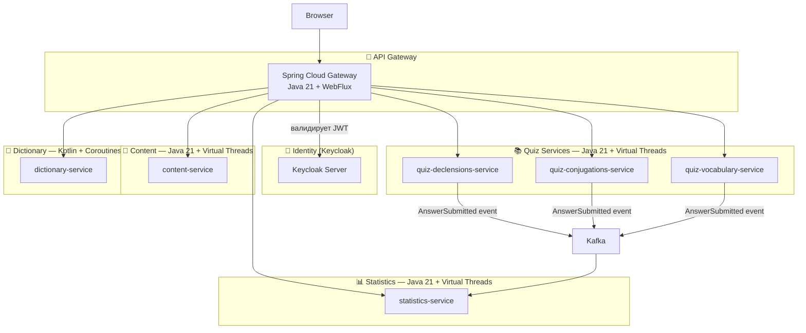

# SamskrtamApp — Project Specification v0.4

> Specification-Driven Development · Microservices · Monorepo
> Stack: Java 21 + Virtual Threads · Kotlin (dictionary-service) · React/TypeScript · PostgreSQL · Keycloak · Kafka
> Status: **DRAFT**

---

## 1. Project Overview

**Name:** SamskrtamApp
**Purpose:** Collaborative platform for a small group to study Sanskrit through quizzes, dictionary lookup, and shared progress tracking.
**Architecture:** Microservices (monorepo), Contract-First SDD
**Interface language:** Russian + English (i18n from day one)

---

## 2. Goals & Non-Goals

### Goals (v1.0)
- Квизы по грамматике санскрита (склонения, спряжения)
- Словарь с fallback на внешнее API
- Статистика через очередь событий
- Групповой лидерборд
- Аутентификация: Keycloak (собственный аккаунт + Google + Mail.ru)
- Bilingual UI (ru / en)

### Non-Goals (v1.0)
- Mobile native app
- Аудио произношения
- Публичная регистрация (только invite через Keycloak Admin)

---

## 3. Язык и стек по сервисам

| Сервис | Язык | Async модель | Причина |
|---|---|---|---|
| api-gateway | Java 21 | WebFlux (Reactor) | Gateway требует реактивный стек |
| content-service | Java 21 | Virtual Threads | Простой CRUD, читаемый код |
| quiz-declensions-service | Java 21 | Virtual Threads | Эталонный паттерн для квизов |
| quiz-conjugations-service | Java 21 | Virtual Threads | Копия паттерна |
| quiz-vocabulary-service | Java 21 | Virtual Threads | Копия паттерна |
| **dictionary-service** | **Kotlin** | **Coroutines** | Практика Kotlin, Cache-aside |
| statistics-service | Java 21 | Virtual Threads | Kafka consumer проще на Java |
| shared/kafka-events | Java 21 | — | Совместимость со всеми сервисами |
| shared/common-dto | Java 21 | — | Совместимость со всеми сервисами |

> **Ключевое решение:** Java 21 Virtual Threads позволяют писать блокирующий
> код (обычный JDBC, RestTemplate) который JVM автоматически делает
> неблокирующим. Не нужен R2DBC и WebFlux там где они избыточны.

---

## 4. Bounded Contexts

---

## 5. Specification Files

### Architecture
| Файл | Содержание |
|---|---|
| [README.md](./README.md) | Этот файл — обзор проекта |
| [architecture.md](architecture.md) | Топология, технологии, монорепо, CI/CD, Kubernetes |
| [keycloak.md](keycloak.md) | Аутентификация, identity providers, JWT claims |
| [api-gateway.md](services/api-gateway.md) | Маршруты, фильтры, rate limiting |

### Architecture Decision Records
| Файл | Решение |
|---|---|
| [decisions/ADR-001-microservices.md](./decisions/ADR-001-microservices.md) | Микросервисы vs монолит |
| [decisions/ADR-002-virtual-threads.md](./decisions/ADR-002-virtual-threads.md) | Java 21 Virtual Threads |
| [decisions/ADR-003-kotlin-dictionary.md](./decisions/ADR-003-kotlin-dictionary.md) | Kotlin для dictionary-service |
| [decisions/ADR-004-keycloak.md](./decisions/ADR-004-keycloak.md) | Keycloak вместо самописного Auth |
| [decisions/ADR-005-kafka.md](./decisions/ADR-005-kafka.md) | Kafka для событий статистики |

### Events
| Файл | Содержание |
|---|---|
| [events/events.md](./events/events.md) | Kafka топики, схемы событий |

### Per-Service Specifications
| Файл | Язык | Сервис |
|---|---|---|
| [services/api-gateway.md](./services/api-gateway.md) | Java 21 + WebFlux | Spring Cloud Gateway |
| [services/content-service.md](./services/content-service.md) | Java 21 + VT | CRUD квизов и вопросов |
| [services/quiz-declensions.md](./services/quiz-declensions.md) | Java 21 + VT | Квиз по склонениям |
| [services/dictionary-service.md](./services/dictionary-service.md) | Kotlin + Coroutines | Словарь + внешнее API |
| [services/statistics-service.md](./services/statistics-service.md) | Java 21 + VT | Статистика и лидерборд |

---

## 6. Milestones

| Milestone | Сервисы | Цель |
|---|---|---|
| **M1 — Foundation** | Gateway + Keycloak + content-service | Auth, CRUD контента, монорепо скелет |
| **M2 — First Quiz** | quiz-declensions-service | Первый рабочий квиз, Contract-First |
| **M3 — Statistics** | statistics-service + Kafka | События, async обработка |
| **M4 — Dictionary** | dictionary-service (Kotlin) | Cache-aside, внешнее API, Kotlin практика |
| **M5 — More Quizzes** | quiz-conjugations + quiz-vocabulary | Масштабирование паттерна |
| **M6 — Polish** | все сервисы | i18n, UX, CI/CD финализация |

---

## 7. Open Questions

- [ ] Ingress controller в кластере — nginx-ingress или Traefik?
- [ ] Persistent storage для PostgreSQL в k8s — local-path или NFS?
- [ ] Внешнее API для словаря: Sanskrit Heritage или Monier-Williams приоритет?
- [ ] Mail.ru OAuth: актуальны ли endpoints в 2025?
- [ ] Автоматический деплой на main или только ручной (when: manual)?
