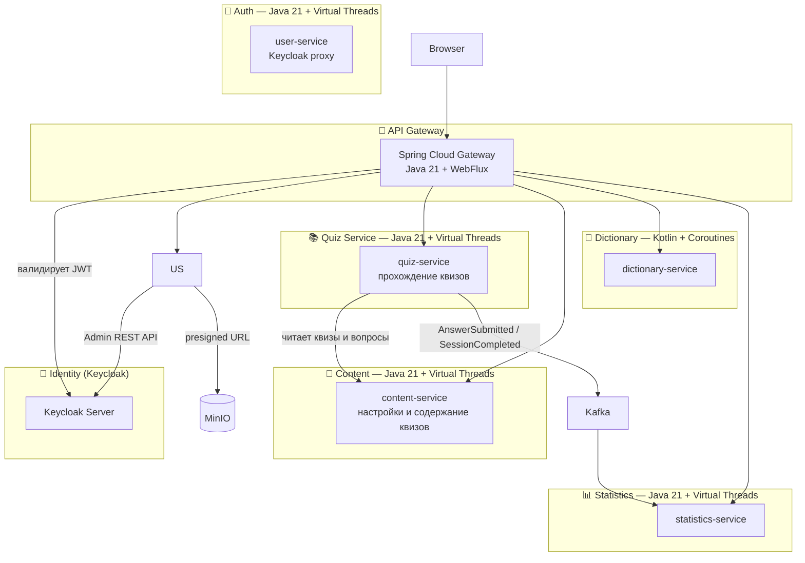

# SamskrtamApp — Project Specification v0.5

> Specification-Driven Development · Microservices · Monorepo
> Stack: Java 21 + Virtual Threads · WebFlux (gateway, quiz-service) · Kotlin (dictionary-service) · React/TypeScript · PostgreSQL · Keycloak · Kafka · MinIO · Grafana Stack (Tempo · Loki · Prometheus)
> Status: **DRAFT**

---

## 1. Обзор проекта

**Название:** SamskrtamApp
**Назначение:** Платформа для изучения санскрита через квизы, поиск по словарю и отслеживание прогресса.
**Архитектура:** Микросервисы (монорепо), Contract-First SDD
**Язык интерфейса:** Русский + English (i18n с первого дня)

SamskrtamApp построен как production-grade референсная реализация современной Java-микросервисной системы. Архитектура намеренно охватывает паттерны, актуальные при высокой нагрузке: событийная асинхронность через Kafka, stateless-сервисы с хранением сессий в Redis, централизованная аутентификация через Gateway, Specification-Driven Development.

Код открыт. Форки и контрибьюции приветствуются.

---

## 2. Goals & Non-Goals

### Goals (v1.0)
- Квизы по грамматике санскрита (склонения, спряжения) и лексике
- Словарь с fallback на внешнее API
- Статистика через очередь событий
- Групповой лидерборд
- Аутентификация: Keycloak (собственный аккаунт + Google + Mail.ru)
- Горизонтальное масштабирование: stateless сервисы, Redis для сессий, Kafka для async
- Bilingual UI (ru / en)

### Non-Goals (v1.0)
- Mobile native app
- Аудио произношения

---

## 3. Язык и стек по сервисам

| Сервис | Язык | Async модель | Причина |
|---|---|---|---|
| api-gateway | Java 21 | WebFlux (Reactor) | Gateway требует реактивный стек |
| user-service | Java 21 | Virtual Threads | Профили, регистрация, аватарки, блокировка |
| content-service | Java 21 | Virtual Threads | CRUD настроек квизов и вопросов |
| quiz-service | Java 21 | WebFlux + R2DBC | Единый сервис прохождения всех квизов |
| **dictionary-service** | **Kotlin** | **Coroutines** | Практика Kotlin, Cache-aside |
| statistics-service | Java 21 | Virtual Threads | Kafka consumer проще на Java |
| shared/kafka-events | Java 21 | — | Совместимость со всеми сервисами |
| shared/common-dto | Java 21 | — | Совместимость со всеми сервисами |

> **Ключевое решение:** Java 21 Virtual Threads позволяют писать блокирующий
> код (обычный JDBC, RestTemplate) который JVM автоматически делает
> неблокирующим. Не нужен R2DBC и WebFlux там где они избыточны.

---

## 4. Bounded Contexts

---

## 5. Specification Files

### Architecture
| Файл | Содержание |
|---|---|
| [README.md](./README.md) | Этот файл — обзор проекта |
| [architecture.md](./architecture.md) | Топология, технологии, монорепо, CI/CD, Kubernetes |
| [conventions.md](./conventions.md) | Соглашения: конфигурация, логирование, трассировка, тесты, git |
| [infra/keycloak.md](./infra/keycloak.md) | Аутентификация, identity providers, JWT claims |
| [services/api-gateway.md](./services/api-gateway.md) | Маршруты, фильтры, rate limiting |

### Events
| Файл | Содержание |
|---|---|
| [events/events.md](./events/events.md) | Kafka топики, схемы событий |

### Per-Service Specifications
| Файл | Язык | Сервис |
|---|---|---|
| [services/api-gateway.md](./services/api-gateway.md) | Java 21 + WebFlux | Spring Cloud Gateway |
| [services/user-service.md](./services/user-service.md) | Java 21 + VT | Логин, регистрация, OAuth, управление паролем |
| [services/content-service.md](./services/content-service.md) | Java 21 + VT | Настройки и содержание всех квизов |
| [services/quiz-service.md](./services/quiz-service.md) | Java 21 + VT | Прохождение квизов пользователем |
| [services/dictionary-service.md](./services/dictionary-service.md) | Kotlin + Coroutines | Словарь + внешнее API |
| [services/statistics-service.md](./services/statistics-service.md) | Java 21 + VT | Статистика и лидерборд |

### Frontend
| Файл | Содержание |
|---|---|
| [frontend/frontend.md](./frontend/frontend.md) | React/TypeScript — страницы, компоненты, типы, хуки, i18n |

---

## 6. Milestones

| Milestone | Сервисы | Цель |
|---|---|---|
| **M1 — Foundation** | Gateway + Keycloak + user-service + content-service | Auth, CRUD контента, монорепо скелет |
| **M2 — First Quiz** | quiz-service (declensions) | Первый рабочий квиз, Contract-First |
| **M3 — Statistics** | statistics-service + Kafka | События, async обработка |
| **M4 — Dictionary** | dictionary-service (Kotlin) | Cache-aside, внешнее API, Kotlin практика |
| **M5 — More Quizzes** | quiz-service (conjugations + vocabulary) | Масштабирование паттерна |
| **M6 — Observability** | все сервисы | Distributed tracing, structured logging, metrics |
| **M7 — Polish** | все сервисы | i18n, UX, CI/CD финализация, load testing |

---

## 7. Open Questions

- [ ] Ingress controller в кластере — nginx-ingress или Traefik?
- [ ] Persistent storage для PostgreSQL в k8s — local-path или NFS?
- [ ] Внешнее API для словаря: Sanskrit Heritage или Monier-Williams приоритет?
- [ ] Mail.ru OAuth: актуальны ли endpoints в 2025?
- [ ] Автоматический деплой на main или только ручной (when: manual)?
