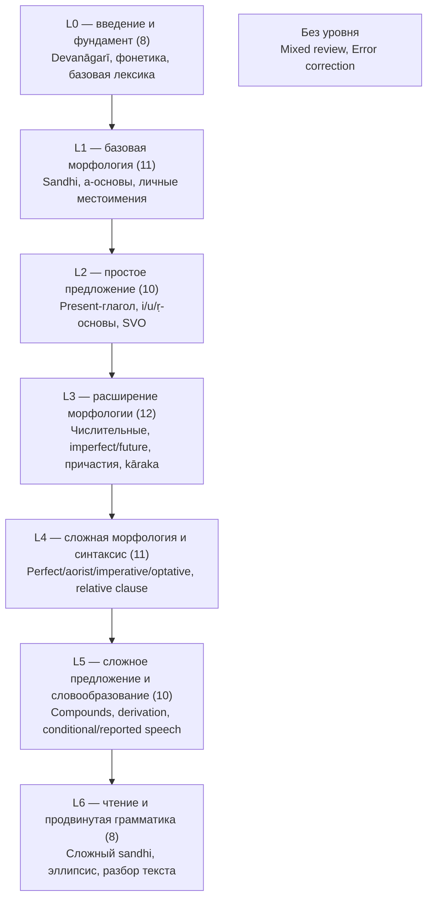

# Curriculum — учебный план и граф зависимостей тем

> Связанные файлы: [curriculum-service.md](./curriculum-service.md) (реализация: сервис,
> схема БД, API), [quest-catalog.md](./quest-catalog.md) · [quest-types-overview.md](./quest-types-overview.md)
> · [learning-materials.md](./learning-materials.md) · [../quests/](../quests/README.md)

Учебный план задаёт рекомендуемый, но не блокирующий порядок прохождения тем. Тема
(`Topic`) — группировка выше `Quest`: объединяет теорию (`LearningMaterial`, см.
`learning-materials.md`) и один или несколько `Quest` одной темы («Kāraka: падежное
управление» — 6 `Quest` по числу ролей). Зависимости фиксируются на уровне `Topic`,
а не `Quest`/`QuestItem` — при ~31 типе квеста попарных связей между отдельными
уроками было бы на порядок больше, чем между темами.

**Этот документ описывает педагогическую модель (что за темы и в каком порядке).
Техническая реализация (сущности, схема БД, API, алгоритм проверки циклов и
топологической сортировки) вынесена в [curriculum-service.md](./curriculum-service.md)
— тема раздроблена с ~20 крупных единиц до 70 атомарных (см. §2), поэтому таблица
`content.topic_prerequisite` из более ранней версии этого документа больше не
актуальна: `Topic`/`TopicPrerequisite` физически живут в отдельном сервисе
`curriculum-service`, не в `content-service`.**

---

## 1. Модель (кратко — детали в curriculum-service.md)

Мягкая связь `TopicPrerequisite(topicId, prerequisiteTopicId, strength)`, где
`strength` — `RECOMMENDED`|`HELPFUL`, влияет только на подсказки в UI, не блокирует
доступ к теме.

**Принципиально:** тема доступна пользователю всегда, независимо от прогресса по её
prerequisite. Связь используется только для:
- бейджа «рекомендуем сначала: …» на карточке темы, если prerequisite ещё не `MASTERED`/`DUE`;
- порядка отображения тем на карте прогресса (topological order вместо алфавитного/случайного);
- подсветки «естественного следующего шага» после завершения текущей темы.

Ничего в quiz-service/content-service не проверяет prerequisite перед стартом сессии —
проверка отсутствует на уровне API, только на уровне подсказки в UI.

**Защита от циклов:** единственная жёсткая проверка во всей модели — curriculum-service
отклоняет сохранение `TopicPrerequisite`, если оно создаёт цикл. Проверяется простым
обходом графа при записи, без отдельного фонового job. Алгоритм — `curriculum-service.md` §3.

Помимо графа prerequisite, каждая тема имеет `learningLevel` (`L0`…`L6`,
авторская классификация первого введения — не то же самое, что топологический
слой, см. `curriculum-service.md` §2/§6) и дискриминатор `domain`
(`GRAMMAR`|`LEXICON` — этот документ описывает только `GRAMMAR`-темы;
lexical-темы — `lexical-curriculum.md`).

---

## 2. Список тем — 70 атомарных Topic по уровням L0–L6

Раздроблено с исходной модели ~20 крупных тем (объединявших, например, «declension
a-основы» для трёх родов одним узлом) до атомарных единиц: каждая строка — один
`Topic`, один самостоятельный quiz. Причина дробления: крупная тема плохо ложится
на прогресс/mastery (пользователь либо «прошёл всю declension a-основ», либо нет —
нет промежуточной гранулярности) и плохо ложится на `ComplexQuiz` (`curriculum-service.md`
§4), которому нужны небольшие, комбинируемые по 2–7 штук единицы.

`learningLevel` — авторская шкала первого введения (не топологический слой,
см. §1). Prerequisite — только ключевые связи (полный граф — в seed-миграции
`V5__seed_grammar_topics.sql`, `services/curriculum-service/.../db/migration/`,
не дублируется здесь построчно для всех 70 тем во избежание рассинхронизации
документа и данных). Тип квеста — по каталогу `quest-catalog.md`; «план» —
тип описан в каталоге, но генератор не реализован; «нет» — для темы пока нет
отдельного `QuestItem`-типа, тема реализуется только через `LearningMaterial`
(обычно — фундаментальная литературная/фонетическая грамотность, до которой
очередь дойдёт после базовых типов, не архитектурный пробел).

### L0 — введение и фундамент (8)

| Код | Тема | Prerequisite | Тип квеста |
|---|---|---|---|
| `deva-svara` | Devanāgarī: svara — гласные | — | нет (LearningMaterial) |
| `deva-vyanjana` | Devanāgarī: vyañjana — согласные | `deva-svara` | нет (LearningMaterial) |
| `matra-conjuncts` | Mātrā и сочетание согласных с гласными | `deva-vyanjana` | нет (LearningMaterial) |
| `deva-diacritics` | Anusvāra, visarga, chandrabindu | `matra-conjuncts` | нет (LearningMaterial) |
| `articulation-places` | Места и способы артикуляции | `deva-vyanjana` | нет (LearningMaterial) |
| `vowel-length-oppositions` | Долгие/краткие гласные и фонетические оппозиции | `deva-svara` | нет (LearningMaterial) |
| `basic-function-words` | Базовые служебные слова | — | `VOCABULARY_WORD` (реализован) |
| `basic-vocabulary-core` | Базовая лексика: человек, предметы, действия | `basic-function-words` | `VOCABULARY_WORD` (реализован) |

### L1 — базовая морфология (11)

| Код | Тема | Prerequisite | Тип квеста |
|---|---|---|---|
| `sandhi-vowels-external` | Sandhi: внешние гласные | `deva-svara` | `SANDHI_SPLIT` (частично) |
| `sandhi-consonants` | Sandhi: согласные | `sandhi-vowels-external` | `SANDHI_SPLIT` (частично) |
| `sandhi-visarga` | Sandhi: visarga | `sandhi-consonants`, `deva-diacritics` | `SANDHI_SPLIT` (частично) |
| `stem-case-concept` | Понятие основы, окончания и падежа | `basic-vocabulary-core` | нет (LearningMaterial) |
| `a-stem-masc` | a-основа: masculine | `stem-case-concept` | `DECLENSION_FORM` (реализован) |
| `a-stem-neut` | a-основа: neuter | `a-stem-masc` | `DECLENSION_FORM` (реализован) |
| `a-stem-fem` | ā-основа: feminine | `a-stem-masc` | `DECLENSION_FORM` (реализован) |
| `case-meanings-basic` | Основные падежные значения | `a-stem-masc` | нет (LearningMaterial) |
| `personal-pronouns` | Личные местоимения | `a-stem-masc` | `DECLENSION_FORM` (реализован) |
| `pronoun-stems-declension` | Основы местоимений и их падежные формы | `personal-pronouns` | `DECLENSION_FORM` (реализован) |
| `verb-root-stem-ending` | Корень, основа и личное окончание | `basic-vocabulary-core` | нет (LearningMaterial) |

### L2 — простое предложение (10)

| Код | Тема | Prerequisite | Тип квеста |
|---|---|---|---|
| `present-parasmaipada-formation` | Present parasmaipada: формирование | `verb-root-stem-ending` | `CONJUGATION_FORM` (план) |
| `present-parasmaipada-usage` | Present parasmaipada: употребление | `present-parasmaipada-formation` | `CONJUGATION_FORM` (план) |
| `present-atmanepada` | Present ātmanepada | `present-parasmaipada-formation` | `CONJUGATION_FORM` (план) |
| `i-u-stems` | i/u-основы | `a-stem-neut`, `a-stem-fem` | `DECLENSION_FORM` (реализован) |
| `r-stems` | ṛ-основы | `i-u-stems` | `DECLENSION_FORM` (реализован) |
| `demonstrative-pronouns` | Указательные местоимения | `pronoun-stems-declension` | `DECLENSION_FORM` (реализован) |
| `interrogative-pronouns` | Вопросительные местоимения | `pronoun-stems-declension` | `DECLENSION_FORM` (реализован) |
| `relative-pronouns` | Относительные местоимения | `demonstrative-pronouns` | `DECLENSION_FORM` (реализован) |
| `noun-adjective-agreement` | Согласование существительного и определения | `a-stem-fem`, `case-meanings-basic` | нет (план) |
| `simple-sentence-svo` | Простое предложение: субъект → объект → глагол | `present-parasmaipada-usage`, `noun-adjective-agreement` | нет (план `SENTENCE_TRANSLATION`) |

### L3 — расширение морфологии (12)

| Код | Тема | Prerequisite | Тип квеста |
|---|---|---|---|
| `numerals-1-4` | Числительные 1–4 | `demonstrative-pronouns` | `NUMERAL_FORM` (план) |
| `numerals-5-10` | Числительные 5–10 | `numerals-1-4` | `NUMERAL_FORM` (план) |
| `numeral-agreement` | Числительные и согласование | `numerals-5-10`, `noun-adjective-agreement` | `NUMERAL_FORM` (план) |
| `imperfect` | Imperfect | `present-parasmaipada-usage` | `CONJUGATION_FORM` (план) |
| `future` | Future | `present-parasmaipada-usage` | `CONJUGATION_FORM` (план) |
| `verb-root-classes-overview` | Основные классы глагольных корней | `present-atmanepada` | нет (LearningMaterial) |
| `present-active-participle` | Present active participle | `present-parasmaipada-formation` | `PARTICIPLE_FORM` (план) |
| `past-passive-participle` | Past passive participle | `verb-root-classes-overview` | `PARTICIPLE_FORM` (план) |
| `absolutive-ktva` | Absolutives: `ktvā` | `present-parasmaipada-usage` | `ABSOLUTIVE_FORM` (план) |
| `absolutive-ya` | Absolutives: `-ya` | `absolutive-ktva` | `ABSOLUTIVE_FORM` (план) |
| `karaka-semantic-roles` | Kāraka и семантические роли | `simple-sentence-svo` | `KARAKA_CASE_CHOICE` (план) |
| `case-as-karaka` | Падежи в роли kāraka | `karaka-semantic-roles` | `KARAKA_CASE_CHOICE` (план) |

### L4 — сложная морфология и синтаксис (11)

| Код | Тема | Prerequisite | Тип квеста |
|---|---|---|---|
| `perfect` | Perfect | `imperfect` | `CONJUGATION_FORM` (план) |
| `aorist` | Aorist | `imperfect` | `CONJUGATION_FORM` (план) |
| `imperative` | Imperative | `present-parasmaipada-usage` | `CONJUGATION_FORM` (план) |
| `optative` | Optative | `present-parasmaipada-usage` | `CONJUGATION_FORM` (план) |
| `participle-past-active` | Participles: past active | `past-passive-participle` | `PARTICIPLE_FORM` (план) |
| `participle-future` | Participles: future | `future`, `present-active-participle` | `PARTICIPLE_FORM` (план) |
| `participial-constructions` | Participial constructions | `participle-past-active`, `karaka-semantic-roles` | `PARTICIPLE_CLAUSE` (план) |
| `irregular-stems-declension` | Сложные основы и нестандартные склонения | `r-stems` | `DECLENSION_FORM` (реализован) |
| `relative-constructions` | Relative constructions | `relative-pronouns`, `case-as-karaka` | `RELATIVE_CLAUSE` (план) |
| `correlative-constructions` | Correlative constructions | `relative-constructions` | `RELATIVE_CLAUSE` (план) |
| `complex-noun-phrases` | Сложные именные группы | `noun-adjective-agreement`, `irregular-stems-declension` | нет (план) |

### L5 — сложное предложение и словообразование (10)

| Код | Тема | Prerequisite | Тип квеста |
|---|---|---|---|
| `compound-words-basics` | Compound words: основы | `complex-noun-phrases` | `COMPOUND_ANALYSIS` (план) |
| `tatpurusha` | Tatpuruṣa | `compound-words-basics` | `COMPOUND_TYPE` (план) |
| `karmadharaya` | Karmadhāraya | `compound-words-basics` | `COMPOUND_TYPE` (план) |
| `bahuvrihi` | Bahuvrīhi | `compound-words-basics` | `COMPOUND_TYPE` (план) |
| `dvandva` | Dvandva | `compound-words-basics` | `COMPOUND_TYPE` (план) |
| `derivation-tva-ta` | Derivation: `-tva`, `-ta` | `past-passive-participle` | нет (план) |
| `derivation-in-vant-mat` | Derivation: `-in`, `-vant`, `-mat` | `derivation-tva-ta` | нет (план) |
| `conditional-constructions` | Conditional constructions | `optative`, `correlative-constructions` | нет (план) |
| `reported-speech` | Reported speech / indirect constructions | `simple-sentence-svo` | нет (план) |
| `complex-subordinate-clauses` | Complex subordinate clauses | `correlative-constructions`, `participial-constructions` | нет (план) |

### L6 — чтение и продвинутая грамматика (8)

| Код | Тема | Prerequisite | Тип квеста |
|---|---|---|---|
| `complex-sandhi-combinations` | Сложные sandhi-комбинации | `sandhi-visarga` | `SANDHI_SPLIT` (частично) |
| `irregular-rare-forms` | Редкие и нерегулярные формы | `irregular-stems-declension`, `perfect` | нет (план) |
| `complex-verb-constructions` | Сложные глагольные конструкции | `aorist`, `optative` | нет (план) |
| `absolute-constructions` | Абсолютные конструкции | `participial-constructions` | `PARTICIPLE_CLAUSE` (план) |
| `complex-relative-constructions` | Сложные относительные конструкции | `correlative-constructions` | `RELATIVE_CLAUSE` (план) |
| `poetic-word-order` | Поэтический порядок слов | `complex-subordinate-clauses` | нет (план) |
| `ellipsis-implied-forms` | Эллипсис и подразумеваемые формы | `poetic-word-order` | нет (план) |
| `syntactic-analysis-of-text` | Синтаксический разбор оригинального текста | `ellipsis-implied-forms`, `complex-verb-constructions` | нет (план `SENTENCE_TRANSLATION`) |

### Без уровня — доступны всегда (`isEvergreen = true`)

| Код | Тема | Тип квеста |
|---|---|---|
| `mixed-review` | Mixed review | `MIXED_REVIEW` (план) |
| `error-correction` | Error correction | `ERROR_CORRECTION` (план) |

Итого: 8+11+10+12+11+10+8 = **70** тем с уровнем + 2 evergreen = 72 строки `Topic`
с `domain = GRAMMAR` (в диапазоне 60–80, запрошенном для степени дробления).

---

## 3. Граф (обзор по уровням)

`learningLevel` (эта диаграмма) — авторская шкала, не то же самое, что
топологический `layer`, вычисляемый по `TopicPrerequisite` на чтение (см. §1 и
`curriculum-service.md` §2/§6): внутри одного уровня темы не обязательно
взаимно независимы (например, в L1 `a-stem-neut`/`a-stem-fem` зависят от
`a-stem-masc` того же уровня) — уровень группирует по «когда вводится», граф —
по «что нужно знать раньше», это разные измерения одной и той же таблицы
`Topic`. Полный граф на уровне отдельных тем (70+2 узла) в документации не
приводится построчно — актуальный источник истины — seed-миграция
`V5__seed_grammar_topics.sql` и runtime `GET /api/v2/curriculum/graph`
(диагностический, `curriculum-service.md` §6); таблицы §2 дают только ключевые
prerequisite-рёбра для понимания логики, не полный список.

---

## 4. UI

- Карта прогресса (`frontend/information-architecture.md`) показывает уровни
  `L0`–`L6` (`GET /api/v2/curriculum/levels`) как сворачиваемые кластеры;
  разворачивание уровня показывает темы внутри него.
- Карточка отдельной темы показывает не весь граф, а только её непосредственные
  prerequisite (1–3 темы) — с бейджем «рекомендуем сначала», кликабельным.
- Тема доступна для клика и прохождения независимо от статуса prerequisite — блокировки нет
  нигде в UI.

---

## 6. Соответствие Milestones

Уровни учебного плана не совпадают 1:1 с Milestones проекта (`README.md §6`) —
Milestone группирует работу по сервисам/инфраструктуре, уровень — по
педагогической последовательности. Ниже — с какого Milestone какой блок тем
становится проходимым (ссылки — на коды из §2):

| Milestone | Что добавляет | Темы, становящиеся доступны |
|---|---|---|
| **M2 — First Quiz** | `DECLENSION_FORM` (declensions) | `a-stem-masc`, `a-stem-neut`, `a-stem-fem` (L1) |
| **M3 — Statistics** | Kafka, события | — (инфраструктура, план не меняется) |
| **M4 — Dictionary** | `VOCABULARY_WORD` (прямое направление) | `basic-function-words`, `basic-vocabulary-core` (L0) |
| **M5 — More Quizzes** | `CONJUGATION_FORM` (parasmaipada laṭ/loṭ), `SANDHI_SPLIT` расширение | `present-parasmaipada-formation`, `present-parasmaipada-usage`, `present-atmanepada` (L2), `sandhi-*` (L1) |
| **M6 — Observability** | инфраструктура, план не меняется | — |
| **M7 — Polish** | оставшиеся типы по мере готовности (см. `quest-types-overview.md`) | L2 (остаток) – L6 постепенно, по мере реализации типов |

Практическое следствие: до M5 включительно граф фактически линеен — L0 → L1 →
начало L2, реальная ветвистость (несколько параллельных путей, синтаксис,
словообразование) появляется только начиная с L3, то есть после M5.
Планировать конкретную очередность внутри L3–L6 имеет смысл ближе к M7, когда
будет ясно, какие типы из `quest-types-overview.md` реализованы, а какие
остаются в Backlog. Большинство тем L2–L6 в §2 помечены типом квеста «план» —
это ожидаемо: раздробление до 70 атомарных тем сделано заранее, реализация
генераторов `QuestItem` под них идёт по мере Milestone, не одновременно с
самим планом.

---

## 7. Открытые вопросы

- Нужен ли `HELPFUL` (в отличие от `RECOMMENDED`) отдельным визуальным сигналом, или в
  первой версии показывать только `RECOMMENDED`.
- Внутри одного `learningLevel` темы не полностью упорядочены графом (например,
  в L3 `numerals-*` и `present-active-participle` независимы друг от друга) —
  стоит ли визуально показывать «параллельность» внутри уровня или оставить как
  единый неупорядоченный кластер на первой итерации.
- Автоматический пересчёт `next recommended topic` на Dashboard — на основе
  прогресса пользователя (все `MASTERED` в уровне N → подсветить уровень N+1)
  — не описан здесь как API, задача при реализации Dashboard.
- Часть тем L4–L6 (`irregular-rare-forms`, `complex-verb-constructions`,
  `poetic-word-order`, `ellipsis-implied-forms` и др.) помечены «нет (план)» —
  для них ещё не описан ни один `QuestItem`-тип даже на уровне
  `quest-catalog.md` (в отличие от «план» для уже описанных, но не
  реализованных типов) — требуется отдельная проработка каталога квестов
  синтаксиса продвинутого уровня, вне периметра этого документа.
