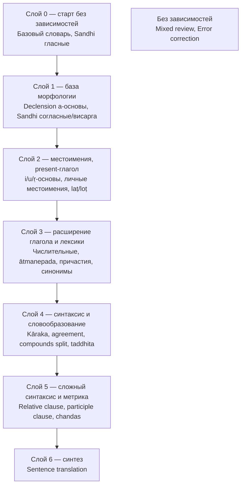

# Curriculum — учебный план и граф зависимостей тем

> Связанные файлы: [quest-catalog.md](./quest-catalog.md) · [quest-types-overview.md](./quest-types-overview.md) · [learning-materials.md](./learning-materials.md) · [../quests/](../quests/README.md)

Учебный план задаёт рекомендуемый, но не блокирующий порядок прохождения тем. Тема
(`Topic`) — группировка выше `Quest`: объединяет теорию (`LearningMaterial`, см.
`learning-materials.md`) и один или несколько `Quest` одной темы («Kāraka: падежное
управление» — 6 `Quest` по числу ролей). Зависимости фиксируются на уровне `Topic`,
а не `Quest`/`QuestItem` — при ~31 типе квеста попарных связей между отдельными
уроками было бы на порядок больше, чем между ~20 темами.

---

## 1. Модель

```java
public enum PrerequisiteStrength { RECOMMENDED, HELPFUL }

/** Мягкая связь: влияет только на подсказки в UI, не блокирует доступ к теме. */
public record TopicPrerequisite(
    UUID topicId,
    UUID prerequisiteTopicId,
    PrerequisiteStrength strength
) { }
```

```sql
CREATE TABLE content.topic_prerequisite (
    topic_id UUID NOT NULL,
    prerequisite_topic_id UUID NOT NULL,
    strength VARCHAR(20) NOT NULL,
    PRIMARY KEY (topic_id, prerequisite_topic_id)
);
```

**Принципиально:** тема доступна пользователю всегда, независимо от прогресса по её
prerequisite. Связь используется только для:
- бейджа «рекомендуем сначала: …» на карточке темы, если prerequisite ещё не `MASTERED`/`DUE`;
- порядка отображения тем на карте прогресса (topological order вместо алфавитного/случайного);
- подсветки «естественного следующего шага» после завершения текущей темы.

Ничего в quiz-service/content-service не проверяет prerequisite перед стартом сессии —
проверка отсутствует на уровне API, только на уровне подсказки в UI.

**Защита от циклов:** единственная жёсткая проверка во всей модели — content-service
отклоняет сохранение `TopicPrerequisite`, если оно создаёт цикл (иначе топологическая
сортировка на фронте не построится). Проверяется простым обходом графа при записи, без
отдельного фонового job.

---

## 2. Список тем и слоёв

Слой — не хранимая сущность, а результат топологической сортировки по `TopicPrerequisite`
(computed, не персистится). Ниже — актуальный срез на момент составления плана.

### Слой 0 — без зависимостей

| Тема | Тип квеста |
|---|---|
| Базовый словарь | `VOCABULARY_WORD` |
| Sandhi: внешнее, гласные | `SANDHI_SPLIT` |

### Слой 1 — база морфологии

| Тема | Prerequisite | Тип квеста |
|---|---|---|
| Declension: a-основы (муж./ср./жен.) | — | `DECLENSION_FORM` |
| Sandhi: внешнее, согласные/висарга | Sandhi: гласные | `SANDHI_SPLIT` |

### Слой 2 — местоимения, present-глагол

| Тема | Prerequisite | Тип квеста |
|---|---|---|
| Declension: i/u/ṛ-основы | Declension a-основы | `DECLENSION_FORM` |
| Pronouns: личные | Declension a-основы | `DECLENSION_FORM` |
| Conjugation: parasmaipada present (laṭ/loṭ) | Declension a-основы, базовый словарь | `CONJUGATION_FORM` |

### Слой 3 — расширение глагола и лексики

| Тема | Prerequisite | Тип квеста |
|---|---|---|
| Pronouns: указательные/вопросительные/относительные | Pronouns личные | `DECLENSION_FORM` |
| Numerals 1–4 | Pronouns указательные | `NUMERAL_FORM` |
| Conjugation: ātmanepada | Conjugation parasmaipada | `CONJUGATION_FORM` |
| Conjugation: laṅ/lṛṭ | Conjugation parasmaipada | `CONJUGATION_FORM` |
| Participles: present active | Conjugation parasmaipada, Declension a-основы | `PARTICIPLE_FORM` |
| Absolutives (ktvā/lyap) | Conjugation parasmaipada | `ABSOLUTIVE_FORM` |
| Infinitives (tumun) | Conjugation parasmaipada | `INFINITIVE_FORM` |
| Vocabulary: synonyms/antonyms/roots/semantic fields/gender | Базовый словарь | `VOCABULARY_*` |

### Слой 4 — синтаксис и словообразование

| Тема | Prerequisite | Тип квеста |
|---|---|---|
| Secondary stems (causative) | Conjugation parasmaipada | `SECONDARY_STEM_FORM` |
| Kāraka: падежное управление | Declension (все основы), Conjugation present | `KARAKA_CASE_CHOICE` |
| Agreement check | Declension, Participles | `AGREEMENT_CHECK` |
| Compounds: split | Declension, базовый словарь | `COMPOUND_SPLIT` |
| Word formation (taddhita) | Базовый словарь, Vocabulary roots | `WORD_FORMATION` |
| Syllable weight | Sandhi (беглость чтения) | `SYLLABLE_WEIGHT` |

### Слой 5 — сложный синтаксис и метрика

| Тема | Prerequisite | Тип квеста |
|---|---|---|
| Relative clause (yad-tad) | Pronouns относительные, Kāraka | `RELATIVE_CLAUSE` |
| Participle clause | Participles, Kāraka | `PARTICIPLE_CLAUSE` |
| Compounds: type | Compounds split | `COMPOUND_TYPE` |
| Chandas identification | Syllable weight | `CHANDAS_IDENTIFICATION` |
| Idioms | Базовый словарь + объём чтения | `IDIOM_MATCH` |

### Слой 6 — синтез

| Тема | Prerequisite | Тип квеста |
|---|---|---|
| Sentence translation | Kāraka, Relative clause, Participle clause | `SENTENCE_TRANSLATION` |

### Без слоя — доступны всегда

| Тема | Тип квеста |
|---|---|
| Mixed review | `MIXED_REVIEW` |
| Error correction | `ERROR_CORRECTION` |

---

## 3. Граф (обзор по слоям)



Полный граф на уровне отдельных тем (~20 узлов) в документации не приводится — на карте
прогресса он показывается сгруппированным по слоям, с разворачиванием слоя по клику (см.
§4); плоский список связей — в таблицах §2.

---

## 4. UI

- Карта прогресса (`frontend/information-architecture.md`) показывает слои как
  сворачиваемые кластеры; разворачивание слоя показывает темы внутри и связи только
  внутри этого слоя плюс входящие связи из предыдущего.
- Карточка отдельной темы показывает не весь граф, а только её непосредственные
  prerequisite (1–3 темы) — с бейджем «рекомендуем сначала», кликабельным.
- Тема доступна для клика и прохождения независимо от статуса prerequisite — блокировки нет
  нигде в UI.

---

## 5. Открытые вопросы

- Нужен ли `HELPFUL` (в отличие от `RECOMMENDED`) отдельным визуальным сигналом, или в
  первой версии показывать только `RECOMMENDED`.
- Слой 3 внутри себя не полностью упорядочен (например, Pronouns указательные и Conjugation
  ātmanepada независимы друг от друга) — стоит ли визуально показывать «параллельность»
  внутри слоя или оставить как единый неупорядоченный кластер на первой итерации.
- Автоматический пересчёт `next recommended topic` на Dashboard — на основе прогресса
  пользователя (все MASTERED в слое N → подсветить слой N+1) — не описан здесь как API,
  задача при реализации Dashboard.
